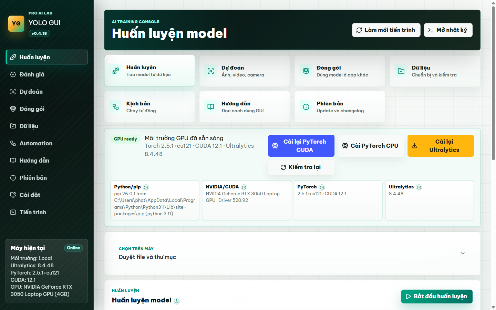
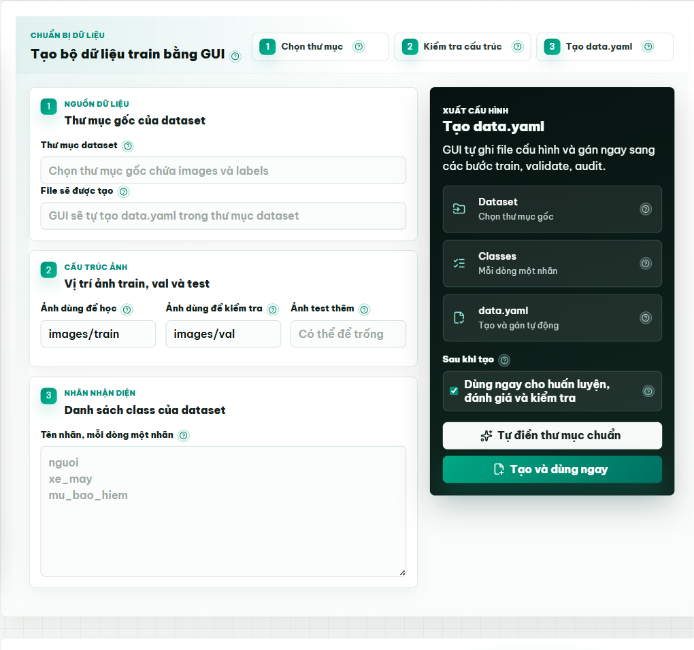
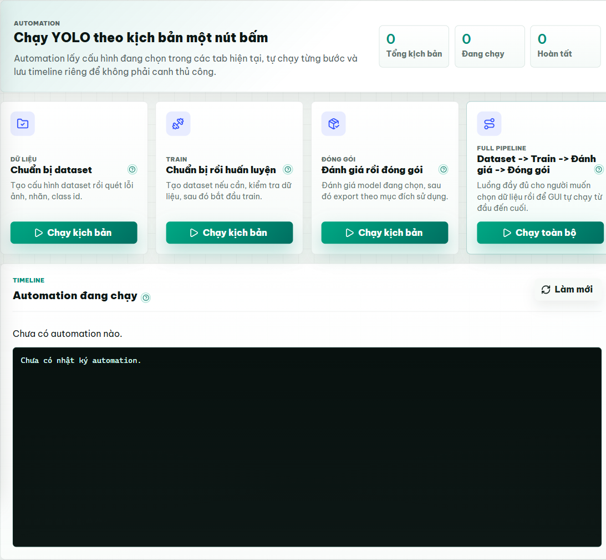
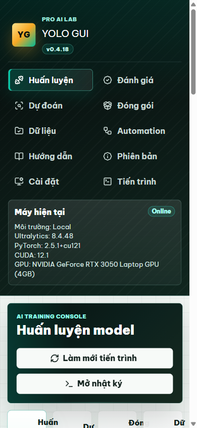

# YOLO GUI

Web GUI local để chạy Ultralytics YOLO mà người dùng không cần nhớ CLI, không cần tự viết `data.yaml`, không cần hiểu tham số YOLO thô. Dự án hướng tới trải nghiệm 100% thao tác bằng giao diện: chọn dữ liệu, chọn mục tiêu, chọn mức huấn luyện, bấm chạy và xem tiến trình ngay trong trình duyệt.

[](https://colab.research.google.com/github/phatchau036/yolo-gui/blob/main/YOLO_GUI_Colab.ipynb)

## Demo giao diện

Ảnh demo được chụp từ bản web GUI hiện tại, gồm màn hình huấn luyện, tạo dataset bằng GUI, automation và layout mobile.

<p align="center">
  
</p>

<p align="center">
  
  
</p>

<p align="center">
  
</p>

## Triết lý 100% GUI

- Người dùng cuối không phải mở terminal để cài Ultralytics/PyTorch hoặc chạy lệnh YOLO.
- Dataset được chuẩn bị bằng wizard: chọn thư mục, nhập tên nhãn, GUI tự tạo cấu hình cần thiết.
- Các tham số khó như device, epochs, batch, confidence, export format được đóng gói thành preset dễ hiểu.
- Log, lỗi cài đặt, lỗi train và trạng thái tiến trình hiện trong GUI.
- Các ô kỹ thuật chỉ nằm ở phần nâng cao không bắt buộc, dùng cho dev hoặc người đã hiểu YOLO.
- Mỗi mục quan trọng có tooltip dấu hỏi để người dùng rê chuột xem giải thích nhanh.
- Có tab `Hướng dẫn` trong app và tài liệu `docs/USER_GUIDE.md` cho người dùng cuối.
- Có tab `Phiên bản` để xem changelog, kiểm tra bản mới trên GitHub và bấm cập nhật.

## Mục tiêu

- Chọn nhanh model YOLO26, YOLO11, YOLOv8 hoặc model đã train.
- Huấn luyện model bằng preset `Test nhanh`, `Cân bằng`, `Train kỹ` hoặc tùy chỉnh nâng cao.
- Đánh giá model bằng preset dễ hiểu, không cần nhớ split hay ngưỡng kỹ thuật.
- Dự đoán ảnh, folder, video hoặc camera bằng lựa chọn GUI; camera hiển thị là `Camera mặc định`, không bắt nhập `0`.
- Đóng gói model theo mục đích sử dụng: app/web, NVIDIA GPU, CPU Intel, mobile, iPhone/Mac, TensorFlow/PyTorch.
- Kiểm tra dataset sâu hơn: đếm ảnh/label, thiếu label, label rỗng, dòng label sai, class id ngoài danh sách.
- Tạo và gán cấu hình dataset trực tiếp trong GUI, convert XML cũ sang nhãn train, tính precision/recall/F1 từ thư mục label prediction và ground truth.
- Tự kiểm tra Python, pip, NVIDIA/CUDA, PyTorch và Ultralytics ngay trên GUI.
- Có nút cài Ultralytics, PyTorch CUDA và PyTorch CPU ngay trên GUI, kèm log cài đặt.
- Có nút kiểm tra/cập nhật phiên bản GUI từ GitHub nếu repo sạch.
- Lưu config, log và kết quả theo từng job để debug/handoff dễ hơn.

## Chạy nhanh trên Windows

```powershell
Set-ExecutionPolicy -Scope Process -ExecutionPolicy Bypass
.\start.ps1
```

Sau đó mở:

```text
http://127.0.0.1:8765
```

## Chạy trên Google Colab

Cách dễ nhất là mở notebook [YOLO_GUI_Colab.ipynb](YOLO_GUI_Colab.ipynb), bấm chạy cell `Chạy YOLO GUI`, đợi link `trycloudflare.com`, rồi mở link đó để dùng GUI.

Nếu đang ở notebook trắng, chạy một cell:

```python
!git clone https://github.com/phatchau036/yolo-gui.git
%cd yolo-gui
!python start_colab.py
```

`start_colab.py` sẽ tự cài requirements, tải `cloudflared`, chạy server local trong Colab và mở Cloudflare Tunnel tạm thời. Giữ cell chạy trong lúc dùng GUI; khi dừng cell hoặc Colab ngắt runtime, link tunnel sẽ tắt.

Hướng dẫn chi tiết: [docs/COLAB_GUIDE.md](docs/COLAB_GUIDE.md).

## Dành cho dev khi cần chạy thủ công

```powershell
python -m venv .venv
.\.venv\Scripts\Activate.ps1
python -m pip install --upgrade pip
python -m pip install -r requirements.txt
python -m uvicorn yolo_gui.app:app --host 127.0.0.1 --port 8765
```

## Cấu trúc chính

- `yolo_gui/app.py`: FastAPI app, API cho frontend, static UI.
- `yolo_gui/training_manager.py`: quản lý job chung cho `train`, `val`, `predict`, `export`.
- `yolo_gui/workflow_runner.py`: tiến trình con gọi Ultralytics Python API theo từng workflow.
- `yolo_gui/dataset_tools.py`: inspect/audit dataset, tạo YAML, VOC XML -> YOLO txt, metrics label.
- `yolo_gui/system_report.py`: tạo report môi trường `.md` và `.json`.
- `yolo_gui/dependency_manager.py`: kiểm tra/cài Ultralytics, PyTorch CUDA/CPU qua GUI.
- `yolo_gui/version_manager.py`: kiểm tra phiên bản, đọc changelog và cập nhật bằng git.
- `yolo_gui/schemas.py`: request/response schema.
- `frontend/`: giao diện web static.
- `start.ps1`: launcher Windows.
- `start_colab.py`: launcher Google Colab, tự chạy server và Cloudflare Tunnel.
- `YOLO_GUI_Colab.ipynb`: notebook Colab để clone/chạy GUI bằng một cell.
- `logs/workflow_jobs/`: log stdout/stderr theo job.
- `logs/dependency_installs/`: log cài Ultralytics, PyTorch CUDA/CPU.
- `logs/colab/`: log uvicorn và Cloudflare Tunnel khi chạy Colab.
- `logs/updates/`: log cập nhật phiên bản bằng GUI.
- `logs/system_reports/`: report môi trường.
- `runs/gui_jobs/`: config JSON theo job.
- `runs/train`, `runs/val`, `runs/predict`: output mặc định.
- `docs/`: tài liệu handoff cho dev tiếp theo.

## Dataset

Người dùng không cần tự viết file cấu hình dataset bằng CLI hoặc editor. Vào tab `Dữ liệu`, chọn thư mục dataset, chọn thư mục ảnh học/kiểm tra, nhập danh sách nhãn rồi bấm `Tạo và dùng ngay`. GUI sẽ tự tạo cấu hình nội bộ và tự điền vào Huấn luyện, Đánh giá, Kiểm tra.

Layout YOLO chuẩn:

```text
dataset-root/
  images/train/
  images/val/
  labels/train/
  labels/val/
```

Nội dung cấu hình do GUI tạo có dạng này để dev dễ debug khi cần:

```yaml
path: C:/datasets/my-dataset
train: images/train
val: images/val
names:
  0: person
  1: car
```

## Ghi chú license

- Tác giả phần GUI: Châu Nghiệp Phát.
- Bạn có thể tải về, fork, học tập, thử nghiệm, chỉnh sửa hoặc đóng góp thêm cho dự án.
- Không được bán lại, đóng gói thành sản phẩm/dịch vụ thu phí, hoặc sử dụng dự án này cho mục đích thương mại nếu chưa có sự đồng ý của tác giả GUI.
- Ultralytics YOLO có lựa chọn AGPL-3.0 và Enterprise. Nếu dùng dự án này cho sản phẩm thương mại/closed-source, cần kiểm tra điều kiện license của Ultralytics trước khi phân phối.

## Đọc tiếp

Người dùng cuối đọc [docs/USER_GUIDE.md](docs/USER_GUIDE.md) trước.

Xem [docs/INDEX.md](docs/INDEX.md) để đọc theo thứ tự dành cho dev mới tiếp quản.
