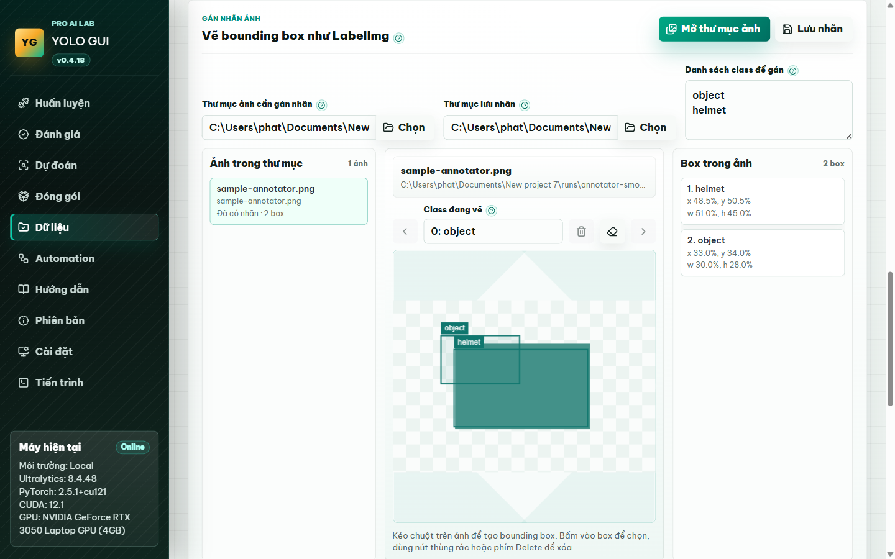

# YOLO GUI

Web GUI local để chạy Ultralytics YOLO mà người dùng không cần nhớ CLI, không cần tự viết `data.yaml`, không cần hiểu tham số YOLO thô. Dự án hướng tới trải nghiệm 100% thao tác bằng giao diện Pro AI Lab: chọn dữ liệu, chọn mục tiêu, chọn mức huấn luyện, bấm chạy và xem tiến trình ngay trong trình duyệt.

[](https://colab.research.google.com/github/phatchau036/yolo-gui/blob/main/YOLO_GUI_Colab.ipynb)

## Demo giao diện

Ảnh demo được chụp từ bản web GUI hiện tại, gồm màn hình huấn luyện, tạo dataset bằng GUI, gán nhãn ảnh kiểu LabelImg, automation và layout mobile.

<p align="center">
  
</p>

<p align="center">
  
  
</p>

<p align="center">
  
  
</p>

## Triết lý 100% GUI

- Người dùng cuối không phải mở terminal để cài Ultralytics/PyTorch hoặc chạy lệnh YOLO.
- Giao diện theo hướng `Pro AI Lab`: sidebar/header tối, vùng thao tác sáng, typography tiếng Việt rõ và các panel giống tool AI/GPU chuyên nghiệp.
- Dataset được chuẩn bị bằng wizard: chọn thư mục, nhập tên nhãn, GUI tự tạo cấu hình cần thiết.
- Có công cụ gán nhãn ảnh trong tab `Dữ liệu`: chọn thư mục ảnh, vẽ bounding box, chọn class và lưu nhãn YOLO `.txt` mà không cần mở LabelImg riêng.
- Các tham số khó như device, epochs, batch, confidence, export format được đóng gói thành preset dễ hiểu.
- Log, lỗi cài đặt, lỗi train và trạng thái tiến trình hiện trong GUI.
- Các ô kỹ thuật chỉ nằm ở phần nâng cao không bắt buộc, dùng cho dev hoặc người đã hiểu YOLO.
- Mỗi mục quan trọng có tooltip dấu hỏi để người dùng rê chuột xem giải thích nhanh.
- Có tab `Hướng dẫn` trong app, tài liệu `docs/USER_GUIDE.md` cho người dùng cuối và bản thao tác chi tiết `docs/GUI_STEP_BY_STEP.md`.
- Có tab `Phiên bản` trên cả Windows và Google Colab để xem changelog, kiểm tra bản mới trên GitHub và bấm cập nhật; Colab giữ nguyên tunnel khi nạp bản mới.
- Có Cloud workspace theo luồng 2 bước: kiểm tra Cloud API key, thêm Google Drive Auth, rồi GUI tự tạo chuẩn thư mục chung để dùng giữa Windows, máy khác và Colab.
- Có Cloud Manager để lưu profile cấu hình GUI, quét model/ảnh/config trong workspace và bấm dùng lại nhanh.

## Mục tiêu

- Chọn nhanh model YOLO26, YOLO11, YOLOv8 hoặc model đã train.
- Huấn luyện model bằng preset `Test nhanh`, `Cân bằng`, `Train kỹ` hoặc tùy chỉnh nâng cao.
- Đánh giá model bằng preset dễ hiểu, không cần nhớ split hay ngưỡng kỹ thuật.
- Dự đoán ảnh, folder, video hoặc camera bằng lựa chọn GUI; camera hiển thị là `Camera mặc định`, không bắt nhập `0`.
- Đóng gói model theo mục đích sử dụng: app/web, NVIDIA GPU, CPU Intel, mobile, iPhone/Mac, TensorFlow/PyTorch.
- Kiểm tra dataset sâu hơn: đếm ảnh/label, thiếu label, label rỗng, dòng label sai, class id ngoài danh sách.
- Tạo và gán cấu hình dataset trực tiếp trong GUI, convert XML cũ sang nhãn train, tính precision/recall/F1 từ thư mục label prediction và ground truth.
- Gán nhãn ảnh theo kiểu LabelImg ngay trong web GUI: mở folder ảnh, vẽ/xóa box, đổi class và lưu nhãn theo chuẩn YOLO.
- Tự kiểm tra Python, pip, NVIDIA/CUDA, PyTorch và Ultralytics ngay trên GUI.
- Có nút cài Ultralytics, PyTorch CUDA và PyTorch CPU ngay trên GUI, kèm log cài đặt.
- Có nút kiểm tra/cập nhật phiên bản GUI từ GitHub nếu repo sạch; trên Colab, link `trycloudflare.com` hiện tại được giữ nguyên, chỉ server phía sau được restart.
- Bật Cloud mode, kiểm tra Cloud API key, thêm Google Drive Auth và để GUI tự tạo workspace Drive theo chuẩn `datasets/models/runs/annotations/configs/exports/logs/projects`.
- Lưu cấu hình hiện tại thành profile trong Cloud Manager, sau đó bấm `Áp dụng` để tự điền lại dataset/model/preset/nguồn dự đoán.
- Đặt tên project trong Cloud workspace và bật `Cloud Storage` để tự lưu config, log, output, model/source tham chiếu và snapshot job theo từng project.

## Chạy nhanh trên Windows

```powershell
Set-ExecutionPolicy -Scope Process -ExecutionPolicy Bypass
.\start.ps1
```

Sau đó mở:

```text
http://127.0.0.1:8765
```

## Chạy trên Google Colab

Cách dễ nhất là mở notebook [YOLO_GUI_Colab.ipynb](YOLO_GUI_Colab.ipynb), bấm chạy cell `Chạy YOLO GUI`, đợi link `trycloudflare.com`, rồi mở link đó để dùng GUI.

Nếu đang ở notebook trắng, chạy một cell:

```python
!git clone https://github.com/phatchau036/yolo-gui.git
%cd yolo-gui
!python start_colab.py
```

`start_colab.py` sẽ tự cài requirements, tải `cloudflared`, chạy server local trong Colab và mở Cloudflare Tunnel tạm thời. Giữ cell chạy trong lúc dùng GUI; khi dừng cell hoặc Colab ngắt runtime, link tunnel sẽ tắt.

Khi cập nhật trong tab `Phiên bản`, Colab sẽ giữ process `cloudflared` đang chạy và chỉ restart server YOLO GUI trên cùng port. Link `trycloudflare.com` không đổi; khi panel `Colab tunnel` báo đã nạp xong, GUI sẽ tự tải lại hoặc bạn bấm `Tải lại GUI`.

Hướng dẫn chi tiết: [docs/COLAB_GUIDE.md](docs/COLAB_GUIDE.md).

## Cloud workspace Google Drive

Vào tab `Cài đặt`, bật `Cloud mode`, nhập Cloud API key rồi bấm `Kiểm tra Cloud key`. Khi key hợp lệ, GUI mới hiện phần `Google Drive Auth`; dán OAuth access token có quyền Drive rồi bấm `Connect Google Drive`.

Sau khi kết nối, GUI tự tạo workspace `YOLO-GUI-Cloud` trong Drive, tạo các folder chuẩn và ghi mirror local. Người dùng không cần tự tạo `Google Drive folder ID` trước.

Khi kết nối thành công, GUI tạo cùng một chuẩn thư mục cho Windows/local và Colab:

```text
YOLO-GUI-Cloud/
  datasets/
  models/
  runs/
  annotations/
  configs/
  exports/
  logs/
  projects/
```

Setting Cloud được lưu local trong `logs/cloud/cloud-settings.local.json` và thư mục này bị `.gitignore`. Không commit API key hoặc Google Drive token lên GitHub. Có thể dùng biến môi trường `YOLO_GUI_GOOGLE_API_KEY` và `YOLO_GUI_DRIVE_ACCESS_TOKEN` nếu không muốn lưu secret trong file local.

Cloud API key chỉ dùng để kiểm tra dịch vụ Google Cloud/Drive API. Google Drive Auth mới là quyền tài khoản để tạo workspace và folder chuẩn trong Drive.

### Project và Cloud Storage

Trong Cloud workspace có thêm `Tên project`. Mỗi project có thư mục riêng:

```text
YOLO-GUI-Cloud/
  projects/
    Helmet Detection/
      configs/gui-settings/
      jobs/train/<job_id>/
      jobs/predict/<job_id>/
      logs/
      runs/
      models/
      datasets/
      annotations/
      exports/
```

Nếu bật `Bật Cloud Storage`, khi job `train`, `val`, `predict` hoặc `export` kết thúc, GUI tự snapshot:

- Config JSON của job.
- Log đầy đủ của job.
- Thư mục job trong `runs/gui_jobs/`.
- Output Ultralytics như `runs/train/gui-train*` hoặc `runs/predict/gui-predict*`.
- File model, `data.yaml` hoặc nguồn ảnh/video/thư mục nếu đường dẫn tồn tại local.
- Manifest `cloud-job-manifest.json` và index `jobs/cloud-jobs-index.json`.

Cloud Storage hiện snapshot vào local mirror theo chuẩn Drive workspace. Tạo folder chuẩn trên Drive đã dùng OAuth access token; upload/sync file lớn hai chiều lên Drive vẫn là phase sau.

### Cloud Manager

Trong cùng tab `Cài đặt`, phần `Cloud Manager` giúp lưu trạng thái GUI hiện tại:

- Cấu hình train/validate/predict/export.
- Dataset wizard và file `data.yaml` đang dùng.
- Model custom, model export và nguồn ảnh/video dự đoán.
- Thư mục ảnh/nhãn của annotator.

Profile được lưu ở `runs/cloud/.../projects/<project_name>/configs/gui-settings/`. Khi mở lại trên máy khác hoặc Colab có cùng Cloud mirror và cùng tên project, bấm `Áp dụng` để GUI tự điền lại form. Cloud Manager cũng quét `models`, `datasets`, `runs`, `exports`, `configs`, `annotations` và `Job snapshots` để bấm dùng nhanh model, ảnh hoặc dataset, đồng thời kiểm tra job nào đã được Cloud Storage lưu.

## Dành cho dev khi cần chạy thủ công

```powershell
python -m venv .venv
.\.venv\Scripts\Activate.ps1
python -m pip install --upgrade pip
python -m pip install -r requirements.txt
python -m uvicorn yolo_gui.app:app --host 127.0.0.1 --port 8765
```

## Cấu trúc chính

- `yolo_gui/app.py`: FastAPI app, API cho frontend, static UI.
- `yolo_gui/training_manager.py`: quản lý job chung cho `train`, `val`, `predict`, `export`.
- `yolo_gui/workflow_runner.py`: tiến trình con gọi Ultralytics Python API theo từng workflow.
- `yolo_gui/dataset_tools.py`: inspect/audit dataset, tạo YAML, VOC XML -> YOLO txt, metrics label.
- `yolo_gui/annotation_tools.py`: liệt kê ảnh, đọc/lưu nhãn YOLO `.txt` cho công cụ gán nhãn ảnh trong GUI.
- `yolo_gui/cloud_manager.py`: lưu Cloud setting local, kiểm tra Cloud API key, dùng Google Drive Auth để tự tạo workspace/folder chuẩn, tạo mirror/manifest, quản lý project Cloud Storage và snapshot job.
- `yolo_gui/system_report.py`: tạo report môi trường `.md` và `.json`.
- `yolo_gui/dependency_manager.py`: kiểm tra/cài Ultralytics, PyTorch CUDA/CPU qua GUI.
- `yolo_gui/version_manager.py`: kiểm tra phiên bản, đọc changelog và cập nhật bằng git.
- `yolo_gui/schemas.py`: request/response schema.
- `frontend/`: giao diện web static.
- `start.ps1`: launcher Windows.
- `start_colab.py`: launcher Google Colab, tự chạy server, Cloudflare Tunnel và restart server cùng port sau update để giữ nguyên link.
- `YOLO_GUI_Colab.ipynb`: notebook Colab để clone/chạy GUI bằng một cell.
- `logs/workflow_jobs/`: log stdout/stderr theo job.
- `logs/dependency_installs/`: log cài Ultralytics, PyTorch CUDA/CPU.
- `logs/colab/`: log uvicorn và Cloudflare Tunnel khi chạy Colab.
- `logs/cloud/`: setting Cloud local, gồm API key hoặc Drive token nếu người dùng chọn lưu từ GUI/env; thư mục này không được commit.
- `logs/updates/`: log cập nhật phiên bản bằng GUI.
- `logs/system_reports/`: report môi trường.
- `runs/gui_jobs/`: config JSON theo job.
- `runs/cloud/`: mirror local, project workspace, job snapshot và manifest metadata của Cloud workspace.
- `runs/train`, `runs/val`, `runs/predict`: output mặc định.
- `docs/`: tài liệu handoff cho dev tiếp theo.

## Dataset

Người dùng không cần tự viết file cấu hình dataset bằng CLI hoặc editor. Vào tab `Dữ liệu`, chọn thư mục dataset, chọn thư mục ảnh học/kiểm tra, nhập danh sách nhãn rồi bấm `Tạo và dùng ngay`. GUI sẽ tự tạo cấu hình nội bộ và tự điền vào Huấn luyện, Đánh giá, Kiểm tra.

Nếu dataset chưa có nhãn, dùng panel `Vẽ bounding box như LabelImg` trong tab `Dữ liệu`: chọn thư mục ảnh, nhập danh sách class, kéo chuột trên ảnh để tạo box, chọn box để đổi class hoặc xóa, rồi bấm `Lưu nhãn`. Khi để trống thư mục lưu nhãn, GUI tự suy ra folder `labels/...` tương ứng với folder `images/...`.

Layout YOLO chuẩn:

```text
dataset-root/
  images/train/
  images/val/
  labels/train/
  labels/val/
```

Nội dung cấu hình do GUI tạo có dạng này để dev dễ debug khi cần:

```yaml
path: C:/datasets/my-dataset
train: images/train
val: images/val
names:
  0: person
  1: car
```

## Ghi chú license

- Tác giả phần GUI: Châu Nghiệp Phát.
- Bạn có thể tải về, fork, học tập, thử nghiệm, chỉnh sửa hoặc đóng góp thêm cho dự án.
- Không được bán lại, đóng gói thành sản phẩm/dịch vụ thu phí, hoặc sử dụng dự án này cho mục đích thương mại nếu chưa có sự đồng ý của tác giả GUI.
- Ultralytics YOLO có lựa chọn AGPL-3.0 và Enterprise. Nếu dùng dự án này cho sản phẩm thương mại/closed-source, cần kiểm tra điều kiện license của Ultralytics trước khi phân phối.

## Đọc tiếp

Người dùng cuối đọc [docs/USER_GUIDE.md](docs/USER_GUIDE.md) trước. Nếu cần hướng dẫn từng nút trong GUI, đọc [docs/GUI_STEP_BY_STEP.md](docs/GUI_STEP_BY_STEP.md).

Xem [docs/INDEX.md](docs/INDEX.md) để đọc theo thứ tự dành cho dev mới tiếp quản.
